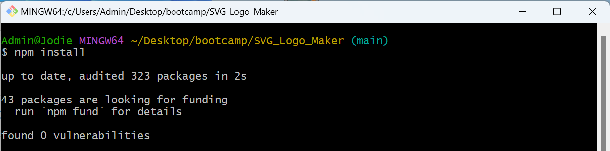
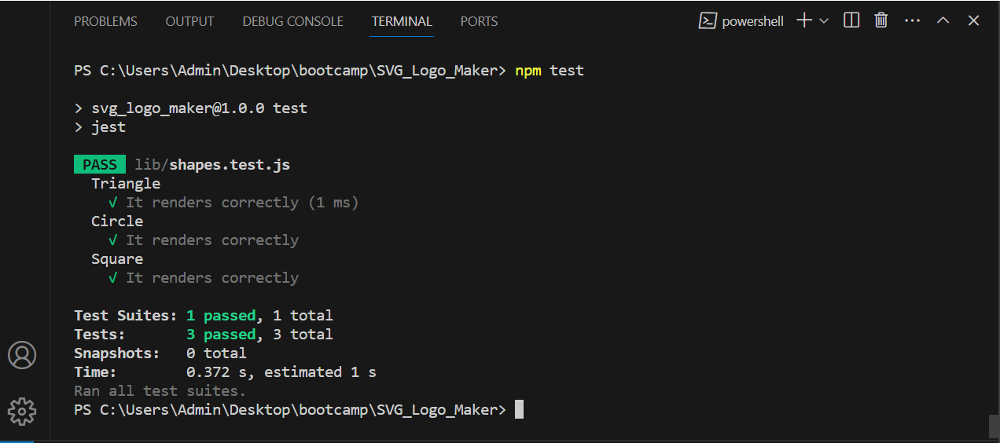

# SVG Logo Maker

[](https://opensource.org/licenses/MIT)

## Description
The SVG Logo Maker is a Node.js command-line application designed to facilitate the creation of custom logos in SVG format. Users can choose colors, shapes, and input text to generate a personalized logo. The application streamlines the process of logo creation, providing a simple yet effective tool for designers and developers.

### Problem Solving
The SVG Logo Maker addresses the need for a quick and efficient method to create logos for various purposes. Whether it's for branding, marketing materials, or personal projects, this tool offers flexibility and customization options to suit different requirements.

### Learning
- Node.js Command-Line Applications: Building a command-line application in Node.js enhances proficiency in JavaScript and expands knowledge of server-side development.
- SVG Generation: Understanding SVG (Scalable Vector Graphics) and its properties is essential for creating high-quality logos that are scalable and resolution-independent.
- User Input Handling: Managing user input through command-line prompts improves skills in handling user interactions and ensures a smooth user experience.
- File I/O Operations: Saving the generated logo as an SVG file involves file input/output operations, providing practical experience in working with files in a Node.js environment.
- Error Handling: Implementing error handling mechanisms helps developers anticipate and address potential issues, leading to more robust and reliable software.

### Features
- Color Selection: Users can choose from a variety of colors to customize the appearance of their logo.
- Shape Options: Different shapes are available, allowing users to select the one that best fits their design concept.
- Text Input: Users can input text to include in the logo, adding a personalized touch to their design.
- SVG Output: Logos are generated in SVG format, ensuring scalability and compatibility across different platforms and devices.

## Table of Contents
- [Installation](#installation)
- [Usage](#usage)
- [License](#license)
- [Questions](#questions)
- [How To Contribute](#how-to-contribute)

## Installation
To install and run the SVG Logo Maker, follow these steps:

1. Clone the repository to your local machine.
    
    ```git clone git@github.com:jodielee062788/SVG_Logo_Maker.git```

2. Navigate to the project directory.

    ```cd svg-logo-maker```

3. Install dependencies using npm.

    ```npm install```

    

## Usage
To use this repository, follow these steps:

1. Run the application using Node.js

    ```node index.js```
  
    

2. Follow the prompts to customize your logo:
    - Enter text to include in the logo.
    - Choose the text color.
    - Select a shape for the logo.
    - Choose a color for the logo.

    

3. Once you've provided all the necessary input, the application will generate the logo and save it as an SVG file.

    

4. Here's a walkthrough video on how to run the application [Walkthrough Video](https://drive.google.com/file/d/1L-y8TNoCY-XDN2JK59fodhw69tHE2woE/view?usp=sharing).

## Test
Once your test files are set up, you can run Jest to execute your tests:

```npm test```



## License
This project is licensed under the MIT license. See the [LICENSE](./LICENSE) file for details.

## Questions
For any questions or inquiries, please feel free to reach out to me via email at jodielee062788@gmail.com. 
You can also find me on GitHub: [jodielee062788](https://github.com/jodielee062788)
  
## How To Contribute
If you'd like to contribute to this project, please follow these guidelines:
1. Fork the repository to your GitHub account.
2. Clone the forked repository to your local machine.
3. Create a new branch for your feature or bug fix.
4. Make your changes and commit them with descriptive commit messages.
5. Submit a pull request.
